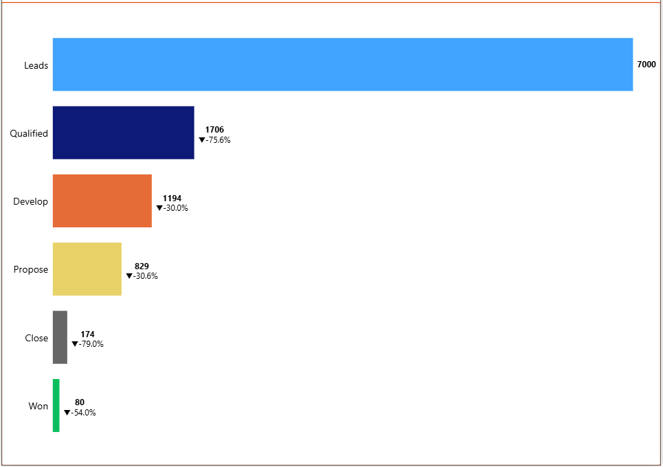
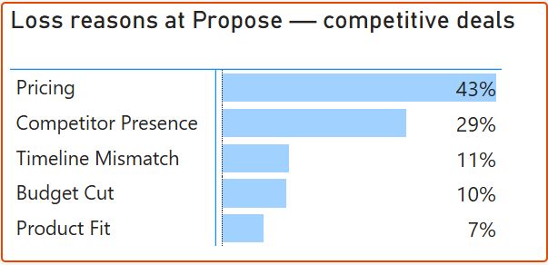
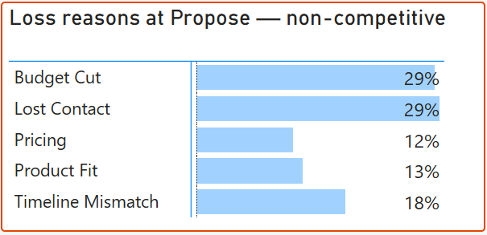
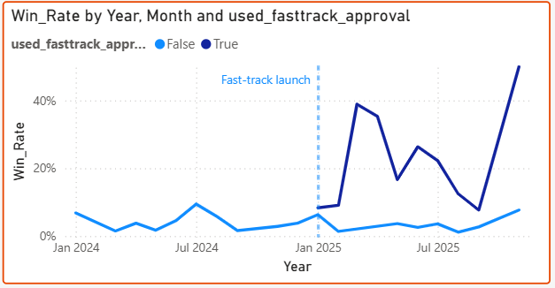

# From 2.8% to 21.4%: How I Analyzed a B2B Sales Funnel and Found the Pricing Problem

## The Problem

The B2B business was receiving around 3400 leads every year but only about 1% of it was being converted to sales. Over two years, 7,000 leads entered the pipeline. Only 80 became closed deals. The rest were lost in the process. The stakeholders wanted to understand why, despite a steady inflow of leads, almost none were converting to closed sales.

## The Analysis

So, as an analyst my job was to find the reason behind it. When I analysed the Lead to Won Opportunities pipeline some interesting things came out.

There were two major areas where the biggest drops were seen. First when lead is converted to opportunity. So here we are filtering out the businesses whose interest doesn't align with the company's solutions. It was around 75%. This was fine because at that stage as one doesn't know about customer's requirements until one talks to them.

The second area was when it has been confirmed that the client's interest has been confirmed and the proposal has been sent to them i.e. in Propose to Close stage. This shouldn't happen as the sales agents have spent time and resources in developing the opportunity, talking to the sellers and making the proposals. So, my next job was to understand why this was happening.

For this i analyzed the loss reasons for the opportunities in the Propose stage. There are two type of deals - competitive and non-competitive. Competitive deals are those where the client is simultaneously evaluating a competing vendor — meaning price response speed and positioning become critical. Non-competitive deals have no known competing vendor in the process.

So for the competitive deals, 43% of opportunities were lost due to Pricing and one third were lost to the competitor. Among the non-competitive deals, 30% were lost as no one contacted them for several days and another 30% as their budget was cut.

## The Solution and Recommendations

To prevent the competitive deals, the company introduced fast-track pricing approval, under which a pre-fixed discount would be given to the customer depeding on the product it requires without requiring approvals from the upper management.

Competitive deals in Period 2 were split into two naturally occurring groups: those where the NAM used fast-track approval, and those that still went through the standard process. The standard-process group served as the control — their win rate stayed flat at 2.1%, confirming that market conditions alone didn't improve results. The fast-track group reached 21.4%.

For non-competitive deals, I suggested to use automatic follow-ups to the deals that have not been contacted for more than 7 days to prevent losing them due to the lost contact. And if there is no reply from the customer in 14 days then the matter is automatically escalated to the manager.

## Tech Stack Used

To complete this project i used Python's pandas library to clean the source data from crm. For analysis I used PostgreSQL — six structured queries covering funnel conversion, loss reason segmentation, NAM performance, lead source ROI, and the fast-track before/after comparison. The dashboards from which i have attached the images here were created in Power BI.

## Conclusion

The instinct when a sales pipeline underperforms is to generate more leads. This analysis showed the opposite was needed — the top of the funnel was fine. The problem was inside it, at a specific stage, for a specific deal type, with a specific fixable cause. That distinction is the difference between a dashboard that describes a problem and an analysis that solves one.

All SQL queries, the Python cleaning script, and the full presentation are available on GitHub at the link below.

[Github - B2B CRM Pipeline Analysis](https://github.com/dhruv-juneja-7/b2b-crm-pipeline-analysis)
